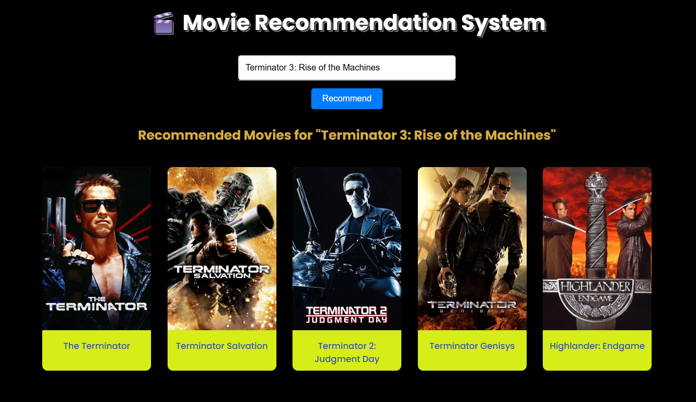

# 🚀 Movie Recommender System [2025] – Smart Flask App with Dynamic Posters

**Discover movies like the future! ⚡  
A blazing fast, mobile-ready recommender that looks AND feels next-gen.**  

---

<!-- replace 'yourusername' with your github username in above badge urls -->

---

## ✨ Why This Project?

- 🧠 **ML-powered — Smarter Recommendations** with instant content similarity
- 🎬 **Dynamic Posters** — Always up-to-date visuals via TMDB API, no stale images
- 💡 **Futuristic UI/UX** — Responsive, dark-ready, modern design with smooth grid
- 🛠️ **Composable Codebase** — True modular structure, scale/read/change in minutes, not days
- 🚀 **Deploys Anywhere** — Render/Heroku/Cloud; zero-config start up
- 🛡️ **Secure by Default** — .env, secrets best practices, and zero hardcoded keys

---

## 🔥 See the Future (Poster Demo)

Searching for a movie instantly shows **real-time posters** for smart recommendations:

> Actual UI: Real movie posters appear as you use the app!
---

## 💡 How It Works

1. Type or select a movie (autocomplete is **instant**!)
2. ML model analyzes content similarity (super fast)
3. App grabs real TMDB poster art on-the-fly
4. UI lays out recommendations in a crisp, mobile-first grid

---

## 🛠️ Project Structure (2025 Standard)

movie-recommender/
├── app/
│ ├── init.py # App factory (prod & dev)
│ ├── config.py # Settings & secrets (never commit your .env!)
│ ├── models/ # All ML/model work (never push >100MB!)
│ ├── routes/ # Flask Blueprints
│ ├── services/ # Business/logic layer
│ ├── templates/ # All HTML (modern, minimal, accessible)
│ └── static/ # CSS/JS/favicon/branding
├── run.py # Unified entry point
├── requirements.txt
├── Procfile.txt # Cloud deploy ready
├── .env.example # Easy setup for everyone
└── README.md

---

## ⚙️ Tech Stack

| 🧩 Tool/Lib      | 🚀 Modern Role                  |
|------------------|-------------------------------|
| Python 3.12+     | Ultimate backend language      |
| Flask            | Ultra-fast web engine          |
| pandas           | Data wrangling rocket fuel     |
| scikit-learn     | Trusted ML & vectorization     |
| requests         | Poster API ace                 |
| Gunicorn         | Cloud deploy champion          |
| HTML/CSS+JS      | Fluid, futuristic UI           |

---

## 🌐 1-Click Local Run

git clone https://github.com/yourusername/movie-recommender.git
cd movie-recommender
python -m venv venv
venv\Scripts\activate # Or source venv/bin/activate
pip install -r requirements.txt
python run.py

Then open [http://localhost:5000](http://localhost:5000)

---

## 🚀 Deploy in the Cloud (Render/Heroku)

1. GitHub push ✔
2. On Render: *New Web Service* → connect repo → start command:

gunicorn run:app

3. Add `TMDB_API_KEY` environment variable
4. Done! Share your futuristic movie app 🚀

---

## 🛡️ Best Practices (Future-Proofed)

- Use `.env` for secrets – never, ever commit API keys
- Models/data >100MB? Use cloud/download scripts, not source repo!
- Code clean and split: logic = service, UI = template, config = config
- Fast start, low memory, high wow-factor!

---

## 💬 Contributing

- Open to PRs! Share new UI ideas, model tweaks, or deploy scripts.
- File issues for bugs or enhancement requests.
- Fork, star, or just enjoy high-tech movie fun 🤖

---

> _Built for tomorrow.  
> Made with 💙 using Flask, ML, and the very latest Pythonic best practices._  
z
